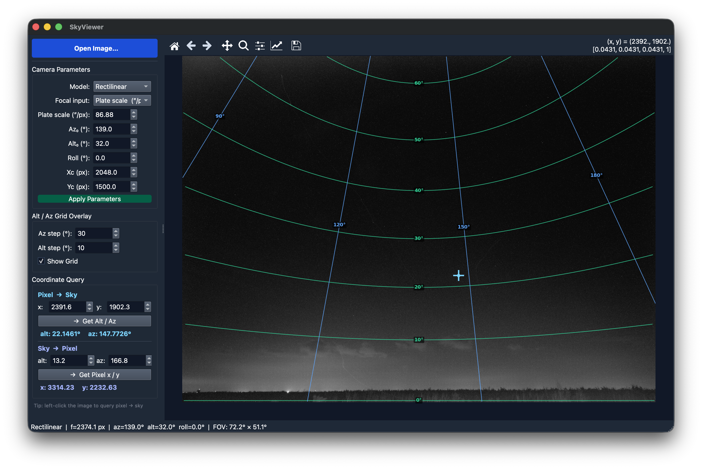

<div align="center">
  
</div>

<br/>

# pixel2sky

**Bidirectional pixel ↔ sky coordinate transformation for any camera.**

`pixel2sky` is a production-grade Python library that maps 2D image pixels `(x, y)` to 3D local horizontal sky coordinates `(Altitude, Azimuth)` and back. It handles both camera *intrinsics* (lens geometry / projection model) and *extrinsics* (pointing direction and sensor orientation), and is fully vectorised for high-throughput processing of entire image grids.

---

## Table of Contents

1. [Mathematical Background](#mathematical-background)
2. [Architecture](#architecture)
3. [Installation](#installation)
4. [SkyViewer — Interactive GUI](#skyviewer--interactive-gui)
5. [Quick Start](#quick-start)
6. [Usage Examples](#usage-examples)
7. [API Reference](#api-reference)
8. [Projection Models](#projection-models)
9. [Running the Tests](#running-the-tests)
10. [Roadmap](#roadmap)
11. [Citation](#citation)
12. [Contributing](#contributing)
13. [License](#license)

---

## Mathematical Background

### Coordinate Frames

The library operates in two right-handed Cartesian frames:

| Frame | +X | +Y | +Z |
|---|---|---|---|
| **World** (local horizontal, ENU) | East | North | Zenith |
| **Camera** (sensor-aligned) | Right (increasing column) | Down (increasing row) | Into the scene (optical axis) |

### Sky Coordinate Convention

Altitude/Azimuth follows the standard local horizontal system:

- **Altitude** (`alt`): elevation above the horizon, `∈ [−90°, 90°]`. Zero is the horizon, 90° is the zenith.
- **Azimuth** (`az`): measured **clockwise from North**, `∈ [0°, 360°)`. 0° = North, 90° = East, 180° = South, 270° = West.

### Alt/Az ↔ World Vector

A sky direction (alt, az) maps to a World-frame unit vector via:

```
X_w = cos(alt) · sin(az)   [East]
Y_w = cos(alt) · cos(az)   [North]
Z_w = sin(alt)             [Zenith]
```

### Extrinsic Rotation

The **World → Camera** rotation `R` is a composition of four elementary operations applied in order:

1. **Azimuth rotation** `R_az`: rotate `−az0` about the World +Z axis so the target azimuth aligns with the boresight direction.
2. **Altitude tilt** `R_alt`: rotate `(alt0 − 90°)` about the East axis to elevate the boresight from the horizon.
3. **Roll** `R_roll`: rotate `−roll` about the optical axis to account for sensor orientation.
4. **Axis permutation** `R_perm`: relabel axes to match Camera-frame convention (+Z forward, +Y down).

```
R = R_perm · R_roll · R_alt · R_az
```

`scipy.spatial.transform.Rotation` is used for numerically stable composition.

### Intrinsic Projection Models

#### Rectilinear (Pinhole)

For standard lenses. Straight lines in 3D map to straight lines in the image.

**Projection** (Camera ray → offset pixel):
```
dx = fx · Xc / Zc
dy = fy · Yc / Zc
```

**Back-projection** (offset pixel → Camera ray):
```
v = normalise( dx/fx,  dy/fy,  1 )
```

Valid for `Zc > 0` (front hemisphere only). Field of view is limited to `< 180°`.

#### Equidistant Fisheye (`r = f · θ`)

For wide-angle and all-sky fisheye lenses. The incidence angle `θ` maps linearly to the radial pixel distance `r`.

**Projection**:
```
θ = arctan2( sqrt(Xc² + Yc²),  Zc )   ∈ [0, π]
r = fx · θ
ϕ = arctan2(Yc, Xc)
dx = r · cos(ϕ)
dy = r · sin(ϕ)
```

**Back-projection**:
```
r = sqrt(dx² + dy²)
θ = r / fx
Xc = sin(θ) · dx / r
Yc = sin(θ) · dy / r
Zc = cos(θ)
```

This model supports the full sphere (`θ ∈ [0°, 180°]`), making it ideal for cameras with fields of view up to 360°.

#### Stereographic Fisheye (`r = 2f · tan(θ/2)`)

The **only** fisheye projection that is *conformal* — it preserves angles at every point. As a practical consequence, Alt/Az grid lines are always perpendicular in the image, matching their geometry on the celestial sphere.

**Projection**:
```
θ = arctan2( sqrt(Xc² + Yc²),  Zc )
r = 2 · fx · tan(θ/2)
ϕ = arctan2(Yc, Xc)
dx = r · cos(ϕ)
dy = r · sin(ϕ)
```

**Back-projection**:
```
r = sqrt(dx² + dy²)
θ = 2 · arctan( r / (2·fx) )
Xc = sin(θ) · dx / r
Yc = sin(θ) · dy / r
Zc = cos(θ)
```

The antipodal point (`θ = 180°`) maps to `r → ∞`; for `θ > ~150°` the radius grows rapidly and typically falls outside any finite sensor.

### Full Transformation Pipeline

```
pixel_to_altaz:
  (x, y)  →  (dx, dy) = (x − cx,  y − cy)
          →  v_cam  =  ProjectionModel.pixel_to_ray(dx, dy)
          →  v_world  =  R⁻¹ · v_cam
          →  (alt, az)  =  world_vector_to_altaz(v_world)

altaz_to_pixel:
  (alt, az)  →  v_world  =  altaz_to_world_vector(alt, az)
             →  v_cam  =  R · v_world
             →  (dx, dy)  =  ProjectionModel.ray_to_pixel(v_cam)
             →  (x, y)  =  (dx + cx,  dy + cy)
             →  mask out-of-sensor pixels → NaN
```

---

## Architecture

```
pixel2sky/
├── src/
│   └── pixel2sky/
│       ├── __init__.py       # Public API surface
│       ├── _version.py       # Single-source version string
│       ├── projection.py     # Intrinsics: ProjectionModel, Rectilinear,
│       │                     #             EquidistantFisheye, StereographicFisheye
│       ├── rotation.py       # Extrinsics: build_rotation, world↔camera
│       │                     #             helpers, altaz↔vector utilities
│       └── mapper.py         # Facade: SkyMapper class
├── tests/
│   ├── test_projection.py    # Unit tests for projection models
│   ├── test_rotation.py      # Unit tests for rotation / coordinate utils
│   └── test_mapper.py        # Integration tests (round-trips, edge cases)
├── pyproject.toml
└── README.md
```

**Design principles:**
- **Separation of concerns**: lens math (`projection.py`), rotation algebra (`rotation.py`), and the high-level API (`mapper.py`) are independently testable.
- **Fully vectorised**: all computations use `numpy` broadcasting; no Python loops at runtime.
- **Extensible**: add a new projection model by subclassing `ProjectionModel` and implementing two methods.

---

## Installation

### From PyPI (once released)

```bash
pip install pixel2sky
```

### From source

```bash
git clone https://github.com/yozorua/pixel2sky.git
cd pixel2sky
pip install -e ".[dev]"
```

**Requirements**: Python ≥ 3.10, NumPy ≥ 1.24, SciPy ≥ 1.10.

---

## SkyViewer — Interactive GUI

<div align="center">
  
</div>

SkyViewer is an interactive desktop application for exploring and validating camera calibrations. Load a sky image, tune the camera parameters, and instantly see Alt/Az grid overlays or query individual pixels.

### Launch

```bash
# Install with GUI extras
pip install "pixel2sky[examples]"

# Or from source
pip install -e ".[examples]"

# Run
python examples/sky_viewer.py
```

### Features

| Feature | Description |
|---|---|
| **Image loading** | Open any JPEG/PNG/TIFF sky image |
| **Projection model** | Switch between Rectilinear, Equidistant Fisheye, and Stereographic (✦ conformal) via dropdown |
| **Focal length modes** | Enter focal length as pixels, plate scale (″/px), or physical (lens mm + sensor μm/px) |
| **Boresight & roll** | Set Az₀, Alt₀, Xc, Yc, and roll directly |
| **Alt/Az grid overlay** | Toggle a live grid overlay (teal iso-altitude lines, blue iso-azimuth lines) |
| **Pixel → Sky query** | Click any pixel to read out its Altitude and Azimuth |
| **Sky → Pixel query** | Enter an Alt/Az to find and mark the corresponding image pixel |

---

## Quick Start

```python
import numpy as np
from pixel2sky import SkyMapper
from pixel2sky.projection import EquidistantFisheye

# Create an all-sky fisheye camera pointing at the zenith
mapper = SkyMapper(
    image_width=2048,
    image_height=2048,
    projection=EquidistantFisheye(plate_scale=344.0),  # 344 arcsec/px
    az0=0.0,    # boresight azimuth: North
    alt0=90.0,  # boresight altitude: zenith
    roll=0.0,
)

# Transform the image centre pixel
alt, az = mapper.pixel_to_altaz(1024.0, 1024.0)
print(f"Centre pixel → Alt={alt:.2f}°, Az={az:.2f}°")
# Centre pixel → Alt=90.00°, Az=0.00°

# Map an entire 4K sky grid
xx, yy = mapper.pixel_grid()          # (2048, 2048)
alt_map, az_map = mapper.pixel_to_altaz(xx, yy)

# Project sky coordinates back to pixels
x_px, y_px = mapper.altaz_to_pixel(alt_map, az_map)
```

---

## Usage Examples

### Standard Lens (Rectilinear)

```python
from pixel2sky import SkyMapper
from pixel2sky.projection import Rectilinear

# Security camera pointing South-East at 30° elevation
mapper = SkyMapper(
    image_width=1920,
    image_height=1080,
    projection=Rectilinear(plate_scale=172.0),  # 172 arcsec/px
    az0=135.0,   # South-East
    alt0=30.0,
    roll=0.0,
)

# What sky region does pixel (960, 540) — the centre — see?
alt, az = mapper.pixel_to_altaz(960.0, 540.0)
print(f"Alt={alt:.4f}°, Az={az:.4f}°")
# Alt=30.0000°, Az=135.0000°

# Horizontal and vertical field of view
fov_h, fov_v = mapper.fov_degrees()
print(f"FOV: {fov_h:.1f}° × {fov_v:.1f}°")
```

### All-Sky Fisheye Camera

```python
import numpy as np
from pixel2sky import SkyMapper
from pixel2sky.projection import EquidistantFisheye

# All-sky camera on an observatory roof
mapper = SkyMapper(
    image_width=4096,
    image_height=4096,
    projection=EquidistantFisheye(plate_scale=196.0),  # 196 arcsec/px
    az0=0.0,
    alt0=90.0,   # zenith-pointing
    roll=0.0,
)

# Horizon ring at alt=0 in 360 steps
az_values = np.linspace(0.0, 360.0, 360, endpoint=False)
alt_values = np.zeros(360)
x_horizon, y_horizon = mapper.altaz_to_pixel(alt_values, az_values)

print(f"North horizon pixel: x={x_horizon[0]:.1f}, y={y_horizon[0]:.1f}")
print(f"East  horizon pixel: x={x_horizon[90]:.1f}, y={y_horizon[90]:.1f}")
```

### Non-Square Pixels / Off-Centre Principal Point

```python
from pixel2sky import SkyMapper
from pixel2sky.projection import Rectilinear

mapper = SkyMapper(
    image_width=1920,
    image_height=1080,
    projection=Rectilinear(plate_scale=258.0, fy_scale=1.002),  # 258 arcsec/px, slight squeeze
    az0=0.0,
    alt0=45.0,
    roll=0.0,
    cx=964.3,   # principal point offset from centre
    cy=542.1,
)
```

### Round-trip Validation

```python
import numpy as np
from pixel2sky import SkyMapper
from pixel2sky.projection import EquidistantFisheye
from numpy.testing import assert_allclose

mapper = SkyMapper(
    image_width=2048,
    image_height=2048,
    projection=EquidistantFisheye(plate_scale=344.0),  # 344 arcsec/px
    az0=0.0, alt0=90.0, roll=0.0,
)

rng = np.random.default_rng(0)
alt_in = rng.uniform(30.0, 90.0, size=10_000)
az_in  = rng.uniform(0.0, 360.0, size=10_000)

x, y = mapper.altaz_to_pixel(alt_in, az_in)
valid = np.isfinite(x) & np.isfinite(y)

alt_out, az_out = mapper.pixel_to_altaz(x[valid], y[valid])
assert_allclose(alt_out, alt_in[valid], atol=1e-6)
assert_allclose(az_out,  az_in[valid],  atol=1e-6)
print(f"Round-trip verified for {valid.sum()} / {len(valid)} points.")
```

---

## API Reference

### `SkyMapper`

```python
SkyMapper(
    image_width: int,
    image_height: int,
    projection: ProjectionModel | None = None,
    az0: float = 0.0,
    alt0: float = 0.0,
    roll: float = 0.0,
    cx: float | None = None,
    cy: float | None = None,
)
```

| Parameter | Description |
|---|---|
| `image_width` | Sensor width in pixels |
| `image_height` | Sensor height in pixels |
| `projection` | Lens model; defaults to `Rectilinear(focal_length=image_width)` (≈ 90° horizontal FOV) |
| `az0` | Boresight azimuth in degrees (clockwise from North) |
| `alt0` | Boresight altitude in degrees (0=horizon, 90=zenith) |
| `roll` | Clockwise sensor roll about the optical axis in degrees |
| `cx` | Principal point x in absolute pixels (default: `image_width / 2`) |
| `cy` | Principal point y in absolute pixels (default: `image_height / 2`) |

**Methods:**

| Method | Description |
|---|---|
| `pixel_to_altaz(x, y)` | Pixels → `(alt, az)` arrays |
| `altaz_to_pixel(alt, az)` | `(alt, az)` → `(x, y)` arrays; out-of-bounds → `NaN` |
| `pixel_grid()` | Returns `(xx, yy)` meshgrid over the full sensor |
| `fov_degrees()` | Returns `(fov_h, fov_v)` approximate field of view |

### `Rectilinear`

```python
Rectilinear(
    plate_scale: float,          # arcsec/px  ← preferred
    cx: float = 0.0,
    cy: float = 0.0,
    fy_scale: float = 1.0,
    # alternative: focal_length=<pixels>
)
```

Standard pinhole model. Valid for front-hemisphere rays only (`Zc > 0`).

### `EquidistantFisheye`

```python
EquidistantFisheye(
    plate_scale: float,          # arcsec/px  ← preferred
    cx: float = 0.0,
    cy: float = 0.0,
    # alternative: focal_length=<pixels>
)
```

Equidistant model (`r = f·θ`). Supports the full sphere including rays behind the optical axis.

### `StereographicFisheye`

```python
StereographicFisheye(
    plate_scale: float,          # arcsec/px  ← preferred
    cx: float = 0.0,
    cy: float = 0.0,
    # alternative: focal_length=<pixels>
)
```

Stereographic model (`r = 2f·tan(θ/2)`). The only conformal fisheye projection — preserves angles at every point in the image. Supports all directions except the exact antipodal point (`θ = 180°`).

### Custom Projection Models

Subclass `ProjectionModel` and implement the two abstract methods. For example, the equisolid-angle model (`r = 2f·sin(θ/2)`) used by many Sony and Sigma fisheye lenses:

```python
from pixel2sky.projection import ProjectionModel
import numpy as np

class EquisolidFisheye(ProjectionModel):
    """r = 2f·sin(θ/2) — preserves solid angle (surface area on the sphere)."""

    def pixel_to_ray(self, dx, dy):
        dx = np.asarray(dx, dtype=np.float64)
        dy = np.asarray(dy, dtype=np.float64)
        r = np.sqrt(dx**2 + dy**2)
        # θ = 2·arcsin(r / 2f)  (clamp to [-1, 1] for numerical safety)
        theta = 2.0 * np.arcsin(np.clip(r / (2.0 * self.fx), -1.0, 1.0))
        sin_theta = np.sin(theta)
        with np.errstate(invalid="ignore", divide="ignore"):
            scale = np.where(r > 0, sin_theta / r, 0.0)
        xc = scale * dx
        yc = scale * dy
        zc = np.cos(theta)
        return np.stack([xc, yc, zc], axis=-1)

    def ray_to_pixel(self, rays):
        rays = self._safe_normalise(np.asarray(rays, dtype=np.float64))
        xc, yc, zc = rays[..., 0], rays[..., 1], rays[..., 2]
        rho = np.sqrt(xc**2 + yc**2)
        theta = np.arctan2(rho, zc)
        r = 2.0 * self.fx * np.sin(theta / 2.0)
        with np.errstate(invalid="ignore", divide="ignore"):
            scale = np.where(rho > 0, r / rho, 0.0)
        return scale * xc, scale * yc
```

---

## Projection Models

| Model | Equation | Typical Use | Max FOV | Status |
|---|---|---|---|---|
| `Rectilinear` | `r = f·tan(θ)` | Standard DSLR / security camera | < 180° | ✅ Implemented |
| `EquidistantFisheye` | `r = f·θ` | All-sky, wide-angle fisheye | 360° | ✅ Implemented |
| `StereographicFisheye` | `r = 2f·tan(θ/2)` | Conformal (angle-preserving) fisheye | < 360° | ✅ Implemented |
| Equisolid angle | `r = 2f·sin(θ/2)` | Solid-angle-preserving fisheye | 360° | Planned |

All three implemented models are provided out of the box; additional models can be added by subclassing `ProjectionModel`.

### Choosing a Projection Model

| Your setup | Recommended model | Why |
|---|---|---|
| Standard DSLR, mirrorless, or security camera (focal length 10–200 mm) | `Rectilinear` | These lenses are designed to satisfy `r ∝ tan(θ)`. Straight lines in the scene appear straight in the image. |
| Wide-angle or all-sky fisheye lens (FOV 100°–360°) | `EquidistantFisheye` | The most common fisheye mapping. Equal angular steps produce equal pixel steps radially, making the star/satellite density uniform. |
| Fisheye lens, but correct angles between features matter most | `StereographicFisheye` | The **only** fisheye mapping that is conformal (angle-preserving everywhere). Alt/Az grid lines always cross at right angles in the image, exactly as they do on the celestial sphere. |
| You have a calibration file from OpenCV or MATLAB | Use the reported `fx`, `fy`, `cx`, `cy` with `Rectilinear` (and undistort first with `cv2.undistort` if `k1 ≠ 0`) | Standard calibration pipelines assume the pinhole model. |

**Quick rule of thumb:**
- Horizon looks straight at any tilt → `Rectilinear`
- Horizon bows outward (barrel) → fisheye; if grid lines stay perpendicular → `StereographicFisheye`, otherwise → `EquidistantFisheye`

> **Note — Lens distortion is not yet modelled.** Current projection models assume an ideal, distortion-free lens. Real lenses exhibit radial distortion (barrel / pincushion) and tangential distortion due to manufacturing imperfections and element misalignment. Support for distortion coefficients is planned; see the [Roadmap](#roadmap) section.

---

## Running the Tests

```bash
# Install development dependencies
pip install -e ".[dev]"

# Run the full test suite
pytest

# With coverage report
pytest --cov=pixel2sky --cov-report=term-missing

# Run a specific test file
pytest tests/test_mapper.py -v

# Type-checking
mypy src/pixel2sky

# Linting
ruff check src/ tests/
```

The test suite includes:
- **Unit tests** for every projection model (round-trip, edge cases, shape contracts)
- **Unit tests** for the rotation module (cardinal directions, azimuth/altitude sweeps, roll)
- **Integration tests** for `SkyMapper` (image-centre to boresight, full Alt/Az → pixel → Alt/Az round-trips, 4K grid throughput)

---

## Roadmap

The following features are **not yet implemented** and are planned for future releases.

### Lens distortion coefficients

All current projection models treat the lens as geometrically ideal. Real cameras have residual distortion that the projection function alone cannot capture. The planned distortion layer will sit between the raw pixel coordinate and the projection model, correcting pixel positions before back-projection and distorting them after forward-projection.

Two standard distortion models are planned:

**Brown-Conrady (radial + tangential)** — the de facto standard used by OpenCV, commonly obtained from a `cv2.calibrateCamera` session:

```
r² = dx² + dy²

dx_d = dx·(1 + k1·r² + k2·r⁴ + k3·r⁶)  +  2·p1·dx·dy  +  p2·(r² + 2·dx²)
dy_d = dy·(1 + k1·r² + k2·r⁴ + k3·r⁶)  +  p1·(r² + 2·dy²)  +  2·p2·dx·dy
```

where `k1, k2, k3` are radial coefficients and `p1, p2` are tangential coefficients.

**Polynomial fisheye (Kannala-Brandt)** — an extension to the equidistant model that adds higher-order terms to correct for real fisheye lenses:

```
r(θ) = k1·θ  +  k2·θ³  +  k3·θ⁵  +  k4·θ⁷
```

Both models require iterative (Newton-Raphson) undistortion during back-projection, which can still be made fully vectorised using `numpy`.

The planned API will be additive and backward-compatible:

```python
from pixel2sky.distortion import BrownConrady

projection = Rectilinear(plate_scale=258.0)  # 258 arcsec/px
distortion = BrownConrady(k1=-0.12, k2=0.08, p1=0.0, p2=0.0)

mapper = SkyMapper(
    image_width=1920,
    image_height=1080,
    projection=projection,
    distortion=distortion,   # new optional parameter
    az0=0.0,
    alt0=45.0,
    roll=0.0,
)
```

Passing `distortion=None` (the default) preserves the current behaviour exactly.

If you need distortion support today, the recommended workaround is to undistort the full image with OpenCV (`cv2.undistort`) before passing pixel coordinates to `SkyMapper`.

---

## Citation

If you use `pixel2sky` in academic work, a research project, or a published pipeline, please cite it as follows.

**BibTeX**

```bibtex
@software{chang2026pixel2sky,
  author       = {Chang, Jamie},
  title        = {{pixel2sky}: Bidirectional Pixel ↔ Sky Coordinate
                  Transformation Library},
  year         = {2026},
  version      = {0.1.0},
  institution  = {Institute of Astronomy, National Tsing Hua University},
  url          = {https://github.com/yozorua/pixel2sky},
  note         = {Python package. NumPy- and SciPy-based; supports
                  rectilinear, equidistant, and stereographic fisheye
                  projection models.}
}
```

---

## Contributing

1. Fork the repository and create a feature branch.
2. Write tests for any new functionality.
3. Ensure `pytest`, `mypy`, and `ruff` all pass.
4. Submit a pull request with a clear description of the change.

Please follow the [Google Python Style Guide](https://google.github.io/styleguide/pyguide.html) and use Google-style docstrings.

---

## License

MIT License — see [LICENSE](LICENSE) for details.